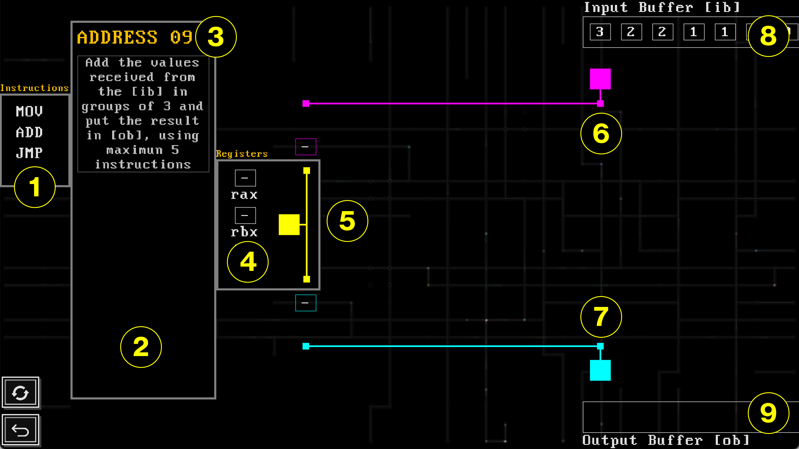
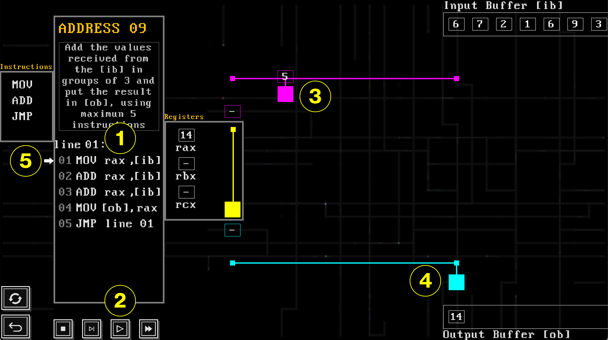
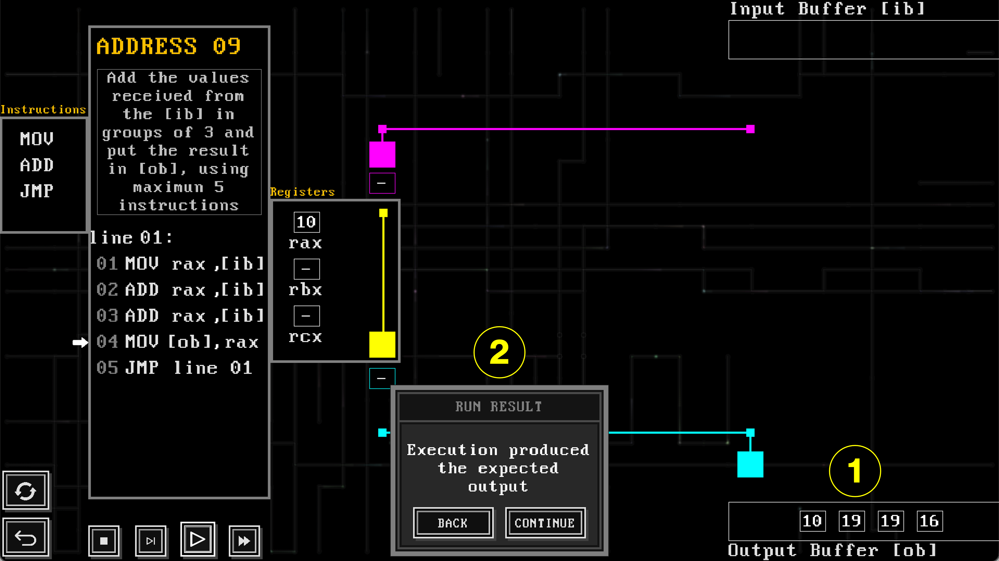

# Assembly Architect

**Assembly Architect** is an educational, puzzle-based video game designed to teach foundational concepts of computer architecture and x86 assembly language through a visual and interactive interface. Instead of treating assembly programming as a purely textual activity, the game externalizes instruction execution, data movement, and architectural constraints as animated, spatial mechanics that players learn through play.

The project is developed in C using SDL2 and currently targets macOS.

---

## 🧠 Concept Overview

**Assembly Architect** reframes real-world x86 assembly programming as a system of playable rules and constraints. Players solve puzzle-based challenges by constructing programs using authentic x86-inspired instructions and observing their execution through animated agents that move values between registers and memory-mapped input buffer, and output buffer.

Architectural rules that are typically enforced syntactically—such as operand restrictions and the prohibition of memory-to-memory transfers—are embodied as spatial constraints and movement limitations within the game world. This design allows players to experience low-level computation as an interactive and observable process rather than as static code and execution traces.

---

## 🎮 Gameplay Mechanics

Players interact with a visual programming interface composed of:

- **Instruction Roster**  
  A constrained set of real x86-inspired instructions available per level to support incremental learning.

- **Code Box**  
  A workspace where players assemble, reorder, edit, or remove instruction sequences.

- **Registers**  
  Virtual registers (e.g., rax, rbx, rcx) used as intermediaries for data movement.

- **Input Buffer (IB)**  
  A memory-mapped input source that provides values to be processed.

- **Output Buffer (OB)**  
  A memory-mapped output destination where results are evaluated against expected outputs.

- **Animated Agents**  
  Visual entities that externalize instruction execution and data flow by physically moving values between architectural components.

Players can execute programs step-by-step or run them continuously to observe how each instruction affects system state.

---

## 🖼️ Screenshots

### 🧩 Level Interface

Level 09: Move values from the Input Buffer (IB) to the Output Buffer (OB) using a maximum of three instructions.

### 🧠 Code Execution

A loop using mov and jmp transfers values from IB to OB while visualizing execution.

### ✅ Challenge Completed

Successful execution with correct output values.

---

## 🧭 Interface Elements

The level interface is composed of interactive components that simulate x86 assembly programming through spatial metaphors and animated agents.

| Label | Element Name | Description |
|------:|--------------|-------------|
| 1 | Instruction Roster | Allows players to select and drag instructions into the Code Box. |
| 2 | Code Box | Workspace where players assemble and edit instruction sequences. |
| 3 | Challenge Description | Textual overview of the level objective. |
| 4 | Register Box | Displays registers available for use as operands. |
| 5 | Registers Agent | Transfers values between registers and buffer agents. |
| 6 | Input Buffer Agent | Moves values from the Input Buffer to registers. |
| 7 | Output Buffer Agent | Moves values from registers to the Output Buffer. |
| 8 | Input Buffer (IB) | Read-and-consume memory-mapped input buffer. |
| 9 | Output Buffer (OB) | Memory-mapped output location for evaluation. |

---

## 🔍 Example Solution

    LINE_01:
        mov rax, [ib]
        mov [ob], rax
        jmp LINE_01

This loop repeatedly reads values from the Input Buffer into register rax, writes them to the Output Buffer, and jumps back to repeat the process. Direct memory-to-memory transfers are disallowed, reflecting real x86 constraints.

---

## 🧩 Level Structure and Progression

**Assembly Architect** includes **16 levels (Levels 00–15)** organized into progressive phases:

- **Levels 00–03 — Foundational Execution**  
  Basic data movement and visible execution, emphasizing register mediation.

- **Levels 04–07 — State and Composition**  
  Multi-register manipulation and arithmetic composition with persistent state.

- **Levels 08–12 — Iteration Under Limits**  
  Repeated execution under fixed instruction budgets, introducing looping behavior.

- **Levels 13–15 — Conditional Termination**  
  Branching and early stopping based on runtime state.

---

## 📚 Educational Objectives

The game is designed to help learners:

- Understand the role of registers and memory in computation  
- Reason about instruction execution and data flow  
- Experience architectural constraints through gameplay  
- Develop debugging and problem-solving strategies  

**Assembly Architect** is intended as a complementary learning experience alongside traditional lectures and assemblers.

---

## 🛠️ Building and Running (macOS)

### Requirements

- macOS (Apple Silicon) 
- clang (Xcode Command Line Tools)  
- SDL2 frameworks:
  - SDL2
  - SDL2_image
  - SDL2_ttf
  - SDL2_mixer

---

### Clone the Repository

    git clone https://github.com/ernestoriv7/AssemblyArchitect.git
    cd AssemblyArchitect

---

### Build and Run (Development Binary)

    make
    ./assemblyArchitect

---

### Build macOS App Bundle

    make app

This produces:

    AssemblyArchitect.app

---

## 🚧 Development Status

**Assembly Architect** is under active development. Planned future work includes:

- Expanded x86 instruction support  
- Additional architecture features (stack, memory)  
- Additional challenge levels  

---

## 🤝 Contributing

Contributions are welcome. Please open an issue or submit a pull request for bug fixes, improvements, or new levels.

---

## 📜 License

This project is licensed under the MIT License. See the LICENSE file for details.